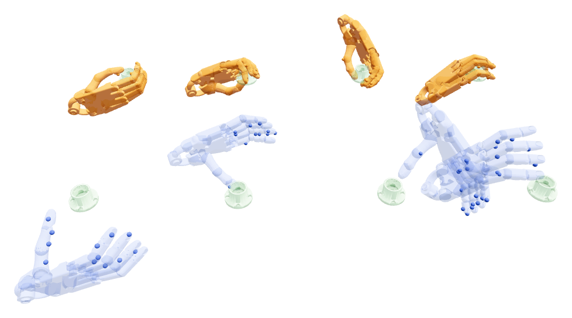

# minimal_graspqp



`minimal_graspqp` is a compact reproduction of the analytical GraspQP pipeline, focused on a small, testable Shadow Hand setup for primitive and mesh-object grasp optimization.

Original paper:

- GraspQP: Differentiable Optimization of Force Closure for Diverse and Robust Dexterous Grasping
- arXiv: <https://arxiv.org/abs/2508.15002>
- Project page: <https://graspqp.github.io/>

Development note:

- Parts of this repository were implemented and iterated with OpenAI Codex.

Attribution:

- This repository is derived from the public GraspQP codebase by the GraspQP authors: <https://github.com/leggedrobotics/graspqp>
- This reduced implementation keeps only a small analytical subset and has been adapted for local experimentation and debugging.
- The original GraspQP repository is released under the MIT License; this repository includes the same license text in [LICENSE](LICENSE).

## Scope

Implemented:

- Shadow Hand loading, forward kinematics, and contact candidate handling
- primitive objects: `sphere`, `cylinder`, `box`
- mesh objects from direct mesh paths or original-style object-code layouts
- differentiable signed distance and surface normals
- grasp energy terms: `E_fc`, `E_dis`, `E_pen`, `E_spen`, `E_joint`
- bounded QP-based force-closure surrogate
- MALA / MALA* optimization
- viser-based visualization

Out of scope:

- Isaac / simulator evaluation
- multi-hand support
- large-scale dataset pipelines
- full paper-scale hyperparameter reproduction

## Environment

This repository is intended to be used with `uv`.

Recommended setup:

- Python `3.11`
- CUDA-enabled PyTorch if you want practical optimization speed
- `mesh` extra for `TorchSDF` / `PyTorch3D`
- `viser` extra for visualization

Create and sync the environment:

```bash
uv venv --python 3.11
uv sync --extra dev --extra mesh --extra viser
```

`uv` already manages the project virtual environment, so you do not need to `source .venv/bin/activate` if you consistently use `uv run`, `uv sync`, and `uv pip`.

Useful checks:

```bash
uv pip list | grep -Ei 'torchsdf|pytorch3d|rtree|viser'
uv run python -c "import importlib.util; print('torchsdf', importlib.util.find_spec('torchsdf') is not None)"
uv run pytest -q
```

## Repository Layout

```text
.
├── assets/                  # local object assets
├── docs/                    # Sphinx docs
├── images/                  # README assets
├── minimal_graspqp/
│   ├── energy/              # grasp energy terms
│   ├── hands/               # Shadow Hand model and FK
│   ├── init/                # grasp initialization
│   ├── metrics/             # wrench and force-closure utilities
│   ├── objects/             # primitive and mesh objects
│   ├── optim/               # MALA / MALA*
│   ├── solvers/             # QP wrappers
│   └── visualization/       # viser scenes
├── outputs/                 # saved optimization results
├── scripts/                 # runnable entry points
├── tests/                   # test suite
├── LICENSE
├── README.md
└── SOFTWARE_REQUIREMENTS.md
```

## Run

### Primitive Visualization

```bash
uv run python scripts/visualize_shadow_hand_with_primitive.py --primitive sphere --palm-down
```

Other supported primitives:

```bash
uv run python scripts/visualize_shadow_hand_with_primitive.py --primitive cylinder
uv run python scripts/visualize_shadow_hand_with_primitive.py --primitive box
```

### Initialization Visualization

```bash
uv run python scripts/visualize_initialization.py --primitive sphere --batch-size 6 --palm-down
```

### Primitive Optimization

Small smoke run:

```bash
uv run python scripts/optimize_primitive.py \
  --primitive sphere \
  --palm-down \
  --batch-size 4 \
  --num-steps 10
```

MALA* smoke run:

```bash
uv run python scripts/optimize_primitive.py \
  --primitive sphere \
  --palm-down \
  --batch-size 4 \
  --num-steps 10 \
  --mala-star
```

Debug run with progress and timing:

```bash
uv run python scripts/optimize_primitive.py \
  --primitive sphere \
  --palm-down \
  --batch-size 4 \
  --num-steps 10 \
  --log-every 1 \
  --profile-every 1
```

### Mesh Optimization

Original-style object-code layout:

```bash
uv run python scripts/optimize_primitive.py \
  --object-root /home/haegu/minimal_graspqp/assets/objects \
  --object-code core_bottle \
  --batch-size 4 \
  --num-steps 20 \
  --num-contacts 12 \
  --mala-star \
  --contact-switch-probability 0.4 \
  --output outputs/core_bottle_optimization.pt
```

Direct mesh path:

```bash
uv run python scripts/optimize_primitive.py \
  --mesh-path /home/haegu/minimal_graspqp/assets/objects/remeshed.obj \
  --batch-size 4 \
  --num-steps 20 \
  --num-contacts 12 \
  --mala-star \
  --contact-switch-probability 0.4 \
  --output outputs/mesh_optimization.pt
```

STL mesh with fingertip-only contact candidates:

```bash
uv run python scripts/optimize_primitive.py \
  --mesh-path /home/haegu/minimal_graspqp/assets/objects/test_object.stl \
  --mesh-scale 0.001 \
  --batch-size 4 \
  --num-steps 200 \
  --num-contacts 12 \
  --mala-star \
  --contact-switch-probability 0.4 \
  --fingertips-only \
  --log-every 5 \
  --output outputs/test_object_fingertips.pt
```
What this command does:

- loads `test_object.stl` as the target mesh
- applies `--mesh-scale 0.001`, useful when the source mesh is authored in millimeters
- runs `4` grasp candidates in parallel
- uses `12` active contacts per candidate
- enables stochastic contact switching with probability `0.4`
- restricts candidates to Shadow Hand fingertip distal links
- writes the result to `outputs/test_object_fingertips.pt`

Project-specific `test_tube.stl` recipes are kept in [`scripts/test_tube_notes.md`](scripts/test_tube_notes.md) instead of this README.

## Result Visualization

Single sample:

```bash
uv run python scripts/visualize_optimization_result.py \
  --input outputs/test_object_fingertips.pt \
  --sample-index 0
```

Whole batch in one scene:

```bash
uv run python scripts/visualize_optimization_batch.py \
  --input outputs/test_object_fingertips.pt \
  --spacing 0.3 \
  --row-spacing 0.4 \
  --port 8081
```

Then open `http://localhost:8081`.

## Runtime Notes

- `scripts/optimize_primitive.py` prints backend status at startup.
- If `torchsdf_installed=False` or `hand_with_torchsdf=False`, optimization can become dramatically slower.
- `MALA*` reset behavior depends on both `--num-steps` and `--reset-interval`. Short runs may use the z-score temperature modulation without ever triggering a reset.
- `--profile-every N` is the fastest way to identify whether runtime is dominated by `penetration`, `force_closure`, or another energy component.

## Documentation

Build the Sphinx docs with:

```bash
uv sync --extra docs
uv run sphinx-build -b html docs docs/_build/html
```

## Testing

Run the test suite:

```bash
uv run pytest -q
```

## License

This repository includes the MIT license text from the original GraspQP repository. If you publish or redistribute this repository or substantial derived portions of the upstream code, keep the license notice and attribution intact.
